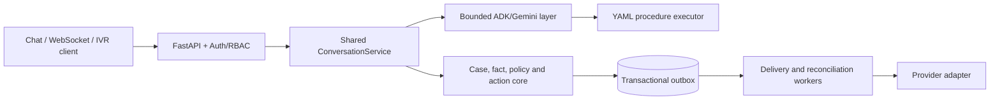

# LLM-Powered Workflow Engine

A provider-neutral workflow control plane for conversational customer service,
fraud operations, and claims workflows.

The application combines Google ADK/Gemini conversations with deterministic
procedures, durable cases and facts, signed policy, typed consequential actions,
transactional delivery, reconciliation, and audit evidence.

> Current status: v3.1.0 is a substantive SQLite-backed engine and development
> reference implementation. Real speech, telephony, chat, contact-center, action
> providers, a production database adapter, and a production-grade UI are not
> included. See [Current Implementation Status](docs/current-state.md).

## Why the application exists

LLMs are useful for understanding requests and producing natural responses, but
they are not reliable authorization systems. This project separates conversation
from control:

- the model proposes intent, facts, workflow direction, and wording;
- deterministic code validates identity, jurisdiction, evidence, and procedure;
- signed policy determines whether an action is allowed;
- the action gateway creates an idempotent command and durable outbox entry;
- a provider adapter performs or reconciles the external effect.

The model and ADK session never become authoritative evidence for a refund, credit,
account restriction, dispute, SAR, case change, or human transfer.

## Architecture at a glance



The full architecture, trust boundaries, transaction boundaries, state machines,
and request sequences are explained in [Application Architecture](docs/architecture.md).

## What works today

### Implemented

- REST and WebSocket chat through one conversation service.
- Transcript-based IVR turn processing with confidence, consent, DTMF, dedupe, and
  readback controls.
- Google ADK router, customer-service, fraud-operations, and general agents.
- YAML procedure loading, routing, state tracking, and branching.
- Z3/SymPy reasoning checks and covered Regulation E response controls.
- SQLite cases, asserted/verified facts, optimistic concurrency, actions, inbox,
  outbox, handoffs, policy, and audit evidence.
- Typed consequential-action payloads and deterministic authorization.
- Signed policy draft, approval, activation, retirement, and key rotation.
- Idempotent action delivery, timeout ambiguity, retry, quarantine, and query-only
  reconciliation.
- JWT/RBAC, correlation IDs, rate limiting, structured errors, CORS, and production
  settings validation.
- Swagger/OpenAPI HTTP contracts and machine-readable WebSocket frame schemas.
- Deterministic local provider emulators and failure injection.

### Simulated or partial

- STT accepts a transcript hint; it does not transcribe audio.
- TTS returns a `sandbox://` reference; it does not generate audio.
- Telephony acknowledges events; it does not control calls.
- Chat delivery records local receipts; it does not send messages externally.
- Human handoff creates a SQLite ticket; it does not connect to a contact center.
- Action execution writes simulated SQLite effects; it does not update a real
  upstream system.
- The Shiny UI is a tested development/operator console, not a production customer portal.
- Metrics are a JSON snapshot; Prometheus and OpenTelemetry are not implemented.
- A separate worker process continuously handles delivery and reconciliation.

### Not included

- real vendor integrations or credentials;
- packaged PostgreSQL/distributed database support;
- customer-grade production frontend;
- enterprise identity federation, managed TLS, secrets, SIEM, or WORM storage;
- legal certification of the default NAM/Reg E profile.

See the complete [capability matrix](docs/current-state.md).

## Main runtime flows

### Conversation

1. A REST, WebSocket, or IVR client submits a normalized message.
2. Authentication binds the actor to the serviced customer.
3. Jurisdiction, consent, and sensitive-input rules run.
4. The durable inbox suppresses duplicates and quarantines sequence gaps.
5. ADK selects a specialist and follows a YAML procedure.
6. Guardrails and deterministic reasoning inspect the response.
7. The response contract decides whether text may stream and whether a success
   claim is allowed.

### Consequential action

1. A typed action request references an authoritative resource.
2. The service reloads the resource and rejects caller/resource mismatches.
3. RBAC, signed policy, evidence, consent, and approval rules run.
4. Authorization and outbox insertion commit atomically.
5. A worker dispatches using a stable provider idempotency key.
6. Definitive outcomes become terminal evidence.
7. Ambiguous timeouts become `unknown` and are reconciled by querying the provider;
   the engine does not blindly redispatch.

See [Application Architecture](docs/architecture.md) for sequence diagrams.

## Quick start

### Prerequisites

- Python 3.11 or newer;
- a Google AI API key for live Gemini conversations;
- Docker and Docker Compose if using containers.

### Local development

```bash
git clone https://github.com/spkc83/llm-powered-workflow-engine.git
cd llm-powered-workflow-engine
python -m venv .venv
source .venv/bin/activate
pip install -r requirements.txt
cp .env.example .env
```

Set `GOOGLE_API_KEY` in `.env`, then start the API:

```bash
uvicorn main:app --reload --port 8000
```

Development startup creates SQLite stores and seeds reference/demo data. Production
disables seeding by default and rejects explicit seeding.

Useful development URLs:

- health: <http://localhost:8000/health>
- Swagger: <http://localhost:8000/docs>
- ReDoc: <http://localhost:8000/redoc>
- OpenAPI: <http://localhost:8000/openapi.json>

### Shiny development UI

```bash
shiny run app_ui.py --port 8001
```

Open <http://localhost:8001>. The console reads `BACKEND_URL`, optionally attaches
`BACKEND_AUTH_TOKEN`, and uses canonical v3 APIs. It is not an identity-aware
production customer frontend. Read [Shiny UI Guide](docs/ui.md).

### Docker development

```bash
docker compose up --build
```

Compose starts the backend, UI, and separate action/reconciliation worker. The
production overlay is a reference single-host SQLite boundary, not a turnkey
production platform; real providers, secrets, TLS, monitoring, and approved storage
remain deployment responsibilities.

### Database management

```bash
python -m workflow_engine.database
python -m workflow_engine.database --reset
```

`--reset` deletes and recreates the configured reference database. Use it only for
development data.

## API surfaces

The canonical API prefix is `/api/v1`.

| Area | Primary endpoints |
|---|---|
| Conversation | `POST /api/v1/conversations/turns`, `POST /api/v1/chat`, `WS /api/v1/ws/chat` |
| IVR adapters | `/api/v1/integrations/ivr/stt:transcribe`, `/tts:synthesize`, `/telephony/events` |
| Chat provider | `/api/v1/integrations/chat/deliveries`, `/receipts` |
| Actions | `POST /api/v1/core/actions`, `POST /api/v1/core/refunds` |
| Human handoff | `/api/v1/handoffs` and callback/status routes |
| Policy | `/api/v1/policies` and approve/activate/retire routes |
| Operations | actions, events, outbox, quarantine, receipts, audit integrity, workers, metrics |
| Contracts | `GET /api/v1/integrations/contracts` |

The detailed route, permission, lifecycle, and error reference is in
[API Reference](docs/api.md). Swagger is the authoritative HTTP schema.

## Configuration

The application uses Pydantic settings and environment variables. Key groups are:

- application and CORS;
- Gemini/ADK;
- core, policy, reference, session, and sandbox storage;
- JWT/RBAC;
- policy signing and jurisdiction;
- upstream mode and worker timing;
- rate limiting, logging, metrics, tracing, reasoning, and compliance.

Read [Configuration Reference](docs/configuration.md) before changing deployment
profiles. Important production invariants are enforced at startup, including auth,
secret, CORS, sandbox, algorithm, and seeding checks.

## Storage

SQLite is the built-in development/default/fallback implementation. By default:

- `data/workflow.db` contains reference business data, local audit, core, and policy
  data;
- `data/adk_sessions_v2.db` contains untrusted ADK session/event state;
- `data/upstream_sandbox.db` contains simulated provider state.

Core and policy protocols accept deployment-supplied adapters. No PostgreSQL adapter
ships with the project. See [Storage and Database Adapters](docs/database.md).

## Security model

- Model, prompt, transcript, tool arguments, and ADK state are untrusted.
- Actor and customer identities are bound separately.
- Consequential actions require typed parameters, RBAC, active signed policy,
  authoritative evidence, and durable idempotency.
- Production rejects default secrets, disabled auth, wildcard CORS, sandbox mode,
  unsafe JWT algorithms, and demo-data seeding.
- Local audit hashes make tampering detectable but do not replace external immutable
  retention.

Read [Threat Model](docs/threat-model.md) and [Security Policy](SECURITY.md).

## Tests

The deterministic suite currently contains 426 tests:

```bash
pytest -q
```

It does not test real providers, complete browser interaction, or legal certification. See
[Testing and Verification](docs/testing.md) for exact coverage and exclusions.

## Repository map

```text
main.py                         FastAPI composition root and routes
app_ui.py                       Shiny development UI (legacy/partial)
procedures/                     YAML conversational procedures
workflow_engine/agents/         ADK router and specialist agents
workflow_engine/conversation/   shared chat/IVR processing and response contracts
workflow_engine/core/           kernel, policy, action gateway, workers, routing
workflow_engine/integrations/   provider protocols and SQLite sandbox adapters
workflow_engine/database/       reference schema, seeding, repositories, audit
workflow_engine/auth/           JWT identities, roles, and permissions
workflow_engine/procedures/     YAML loading, registry, and executor
tests/                          deterministic unit and integration tests
docs/                           architecture, operation, integration, and user manuals
```

## Documentation map

- [Application Architecture](docs/architecture.md) — how the system works end to end.
- [Current Implementation Status](docs/current-state.md) — implemented, partial,
  sandbox, deployment-supplied, and missing capabilities.
- [Configuration Reference](docs/configuration.md) — every configuration group and
  production invariant.
- [API Reference](docs/api.md) — routes and contracts.
- [Upstream Integration Guide](docs/integration-guide.md) — provider boundaries.
- [Shiny UI Guide](docs/ui.md) — current UI behavior and limitations.
- [Testing and Verification](docs/testing.md) — what tests prove and exclude.
- [Core Engine](docs/core-engine.md) — control-plane invariants.
- [Database](docs/database.md) — stores, tables, and portability.
- [Operations](docs/operations.md) — startup, workers, recovery, and canary.
- [Governance](docs/governance.md) — policy and jurisdiction.
- [Threat Model](docs/threat-model.md) — trust boundaries and residual risk.
- [Migration](docs/migration.md) — v2 to v3 upgrade.
- [Procedure Authoring](docs/procedures.md) — YAML workflow extension.
- [Chat and IVR Channels](docs/channels.md) — channel contracts.
- [User Guide](docs/user-guide.md) — customer and service-operator behavior.

## Contributing and license

The project is maintained by `spkc83`. See [Contributors](CONTRIBUTORS.md) and
[Contributing](CONTRIBUTING.md).

Licensed under the [MIT License](LICENSE).
