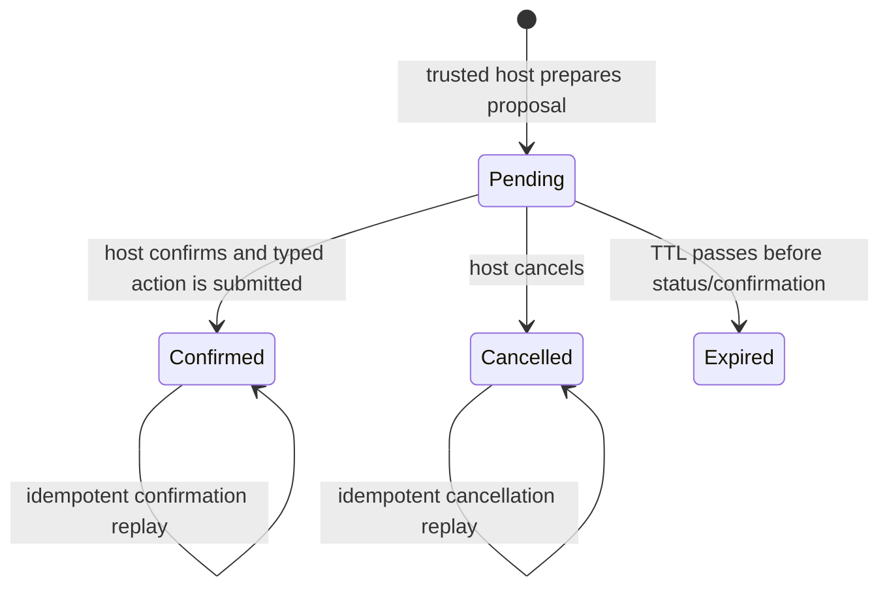

# Conversational Action Bridge

This page is the authoritative v3.2 description of how a customer conversation
can lead to a real action without allowing the model to authorize or execute it.

## Why the bridge exists

Conversation and action execution have different trust requirements. The model is
useful for recognizing that a customer wants a refund and collecting a reason. It
is not trusted to choose the authenticated actor, serviced customer, policy,
provider endpoint, credential, evidence reference, idempotency key, or final
authorization decision.

`ActionBridge` connects the two domains with a durable two-step protocol:

```text
model proposes intent -> host creates pending proposal -> human confirms/cancels
                    -> typed action service -> gateway -> connector -> outcome
```

No provider call occurs while the proposal is pending.

## End-to-end customer chat example

Assume the Shiny demo user selects `CUST-456` and asks:

> Refund order ORD-123 because the item never arrived.

1. Shiny sends `POST /api/v1/chat` with the customer, message, and optional session.
2. FastAPI authenticates the actor and resolves which customer that actor may serve.
3. `ConversationService` performs provider-scoped deduplication and ordering.
4. ADK routes the turn to the customer-service agent and follows `cs_refund`.
5. The agent uses read tools to inspect the order. If the procedure reaches the
   action step, its `issue_refund` tool writes only an `ActionIntent` to ADK session
   state and returns `confirmation_required`.
6. After generation, trusted host code removes pending intents from session state.
   It does this before preparation so a failed intent is not silently replayed.
7. The host checks the closed action catalog and actor permission, derives the case,
   procedure, active signed policy, actor/customer, message, and conversation values,
   and calls `ActionBridge.propose`.
8. The bridge reloads the order through the authoritative resource adapter, evaluates
   refund eligibility, replaces model-supplied authoritative values, computes a stable
   idempotency key, resolves the active connector binding, and stores a pending proposal.
9. The chat response contains normal text plus `action_proposals`. Shiny renders the
   proposal's safe preview and expiry without parsing assistant prose.
10. The user chooses **Confirm action** or **Cancel**. The model has no confirmation tool.
11. Confirm calls `POST /api/v1/action-proposals/{id}/confirm`. The server rechecks
    actor/customer ownership, expiry, authoritative resource version, connector
    binding version, required consent/approval, and policy/procedure binding.
12. The bridge builds `ConsequentialActionRequest` and invokes
    `ConsequentialActionService`. The service reloads authoritative data again,
    verifies facts, and asks `ActionGateway` to authorize and dispatch.
13. The core writes action and outbox/event evidence. The connector performs the
    demo SQLite effect or production provider call.
14. Shiny calls `GET /api/v1/actions/{action_id}` and displays the authoritative
    status, outcome, and event history. Assistant text is never used as proof of success.

## Proposal state machine



The default TTL is 900 seconds. A proposal stores immutable payload, preview,
resource version, actor/customer/case, procedure/policy, conversation/message,
idempotency key, and connector binding/contract versions. SQLite uses an atomic
compare-and-set transition. Other `CoreStore` implementations must preserve the
same semantics.

Current limitation: expiry is applied lazily when proposal status or confirmation
is requested; no separate expiry sweeper ships.

## Action lifecycle after confirmation

Proposal state and action state are distinct. A `confirmed` proposal means the
typed action was submitted and has an action ID; it does not itself mean the
provider effect succeeded.

```text
requested -> authorized -> dispatched -> succeeded
                                  |----> failed
                                  `----> unknown -> reconciled|failed|unknown
```

Only authoritative `succeeded` or `reconciled` action status permits a success
claim. Provider timeouts become `unknown`; the reconciliation worker queries status
without blindly issuing the command again.

## Closed action catalog

The registry binds only actions defined by code in `ACTION_SPECIFICATIONS` and the
typed discriminated payload union. Current action names are:

- `issue_refund`
- `issue_store_credit`
- `update_case_status`
- `file_eft_dispute`
- `issue_provisional_credit`
- `escalate_to_supervisor`
- `add_case_note`
- `flag_account`
- `submit_sar`
- `close_alert`

Configuration can bind these actions to providers. Configuration cannot invent a
new consequential action. Adding one requires code-defined payload, permission,
risk, authoritative fields, consent/approval rules, policy allowance, procedure
integration, and tests.

## Connector registry

Set `ACTION_REGISTRY_PATH` to a versioned YAML or JSON file. Each enabled action has
one active binding. Binding IDs, binding versions, and contract versions are stamped
by the server during authorization and used for later dispatch/reconciliation.
Callers and model tools cannot choose them.

### SQLite demo binding

```yaml
version: 1
bindings:
  - action_name: issue_refund
    binding_id: sqlite-demo:issue_refund
    binding_version: "1"
    contract_version: v1
    transport: sqlite
    database_url: sqlite+aiosqlite:///data/upstream_sandbox.db
```

The composition root supplies the actual trusted SQLite connector by binding ID or
action name. SQLite/demo bindings are rejected in production. When no registry file
is set in development sandbox mode, the application creates equivalent bindings for
the full closed catalog. Refund uses the reference refund connector; other actions
use the SQLite sandbox connector.

### REST/OpenAPI binding

```yaml
version: 1
bindings:
  - action_name: issue_store_credit
    binding_id: commerce-credit
    binding_version: "2026-07-13"
    contract_version: "1"
    transport: rest
    base_url: https://commerce.example.com
    allowed_hosts: [commerce.example.com]
    timeout_seconds: 10
    idempotency_header: Idempotency-Key
    secret_ref: env://COMMERCE_TOKEN
    auth_header: Authorization
    auth_scheme: Bearer
    openapi:
      path: ./commerce-openapi.yaml
      sha256: 0123456789abcdef0123456789abcdef0123456789abcdef0123456789abcdef
    execute:
      operation_id: issueStoreCredit
      method: POST
      path: /credits
      body:
        orderId: $.parameters.order_id
        amount: $.parameters.amount
    reconcile:
      operation_id: getStoreCredit
      method: GET
      path: /credits/status
      query:
        idempotencyKey: $.idempotency_key
    statuses:
      succeeded: [200, 201]
      accepted: [202]
      failed: [400, 401, 403, 404, 409, 422]
    provider_operation_id_pointer: $.provider_operation_id
    response_fields:
      credit_id: $.credit.id
```

At startup the loader verifies:

- the action is in the closed catalog;
- active bindings and binding ID/version pairs are unique;
- the base host is explicitly allow-listed;
- production REST uses HTTPS;
- credentials are references (`env://` or `secret://`), not inline values;
- asynchronous status mappings have a reconciliation operation;
- the local OpenAPI file matches its SHA-256 digest;
- configured operation IDs, methods, and paths match the pinned OpenAPI document.

The mapping language is intentionally small: `$.action`, `$.case_id`, `$.actor_id`,
`$.idempotency_key`, `$.parameters.<field>`, and `$.prior.<field>`. It does not
evaluate code or accept a URL from a model. Provider responses persist only HTTP
status, provider operation ID, and explicitly allow-listed `response_fields`.

`202 Accepted`, an unmapped status, a timeout, or network ambiguity returns
`unknown`; it is not success. Redirects are disabled. The current built-in secret
provider resolves only `env://`; a deployment factory is required for
`secret://` references.

Runnable configuration examples are in
[`examples/action-registry.rest.example.yaml`](../examples/action-registry.rest.example.yaml)
and [`examples/openapi/commerce-actions.yaml`](../examples/openapi/commerce-actions.yaml).

### Python connector escape hatch

```yaml
- action_name: submit_sar
  binding_id: bank-sar
  binding_version: "4"
  contract_version: "2"
  transport: python
  factory: bank_integrations.sar:create_connector
```

The trusted factory receives the validated binding and must return an object with
async `dispatch(command)` and `reconcile(command, prior)` methods. Installing such
a factory is equivalent to installing application code; review and allow-list it.

### WebSocket provider binding

The registry validates `websocket` binding models (`ws`/`wss`, allow-listed host,
execute/reconcile message shapes, ACK type, outcome type), but v3.2 intentionally
does not implement a generic WebSocket connector. An enabled WebSocket binding
fails startup with a contract-only error. A deployment that needs WebSocket should
use a reviewed Python connector and implement reconnect, resume, sequencing,
backpressure, ACK-versus-outcome separation, idempotency, and reconciliation.

WebSocket chat at `/api/v1/ws/chat` is unrelated: it is a customer conversation
transport, not a provider action connector.

## MCP façade and trust boundary

FastMCP Streamable HTTP is mounted at `/mcp`. It is stateless at the transport
layer; durable proposal/action state stays in the core store. It exposes only:

- tools `actions_prepare` and `actions_get_status`;
- resource `actions://catalog`;
- resource template `actions://proposals/{proposal_id}`;
- prompts `actions_workflow` and `actions_safety`.

There is no confirm, approve, execute, dispatch, connector, credential, or provider
configuration tool. `actions_prepare` accepts only action/business arguments and an
optional resource type/ID. It rejects trusted fields hidden in arguments.

The outer FastAPI authentication middleware supplies the actor. Customer-role
tokens are bound to their own customer. Staff/integration hosts send
`X-Workflow-Customer-ID`; optional `X-Workflow-Procedure-ID`,
`X-Workflow-Conversation-ID`, and `X-Workflow-Message-ID` provide trusted host
correlation. In development without auth, the resolver defaults to the dev actor
and `CUST-456`. Production hosts must protect these headers and enforce delegation.

MCP proposals use the same `ActionBridge`; confirmation still occurs through the
host REST/UI control. MCP status `confirmed` still does not prove provider success.

## Direct typed APIs

`POST /api/v1/core/actions` and compatibility `POST /api/v1/core/refunds` remain for
trusted service clients. They use the typed gateway but bypass the conversational
proposal UI. Prefer the proposal endpoints for customer chat workflows.

## Known limitations

- The Shiny console is a demo/operator surface, not a production customer portal.
- Confirmation currently creates server-owned host evidence on button/API use; it
  is not a cryptographic customer signature or step-up authentication ceremony.
- The bridge compares a proposal with the currently active connector binding at
  confirmation; planned binding changes invalidate pending proposals.
- A non-SQLite `CoreStore`, policy repository, or production resource/provider
  adapter must be supplied and certified by the deployment.
- No generic callback endpoint for REST action providers is included; use query
  reconciliation or a custom Python integration.
- No generic WebSocket provider runtime is included.
- MCP does not provide confirmation, execution, or provider administration.
