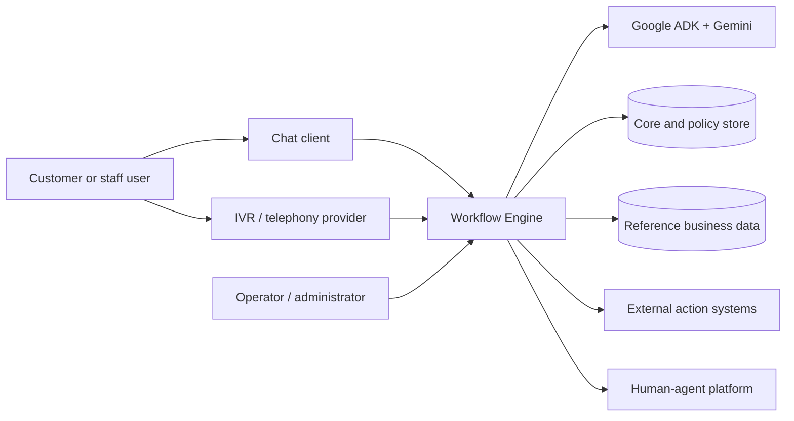
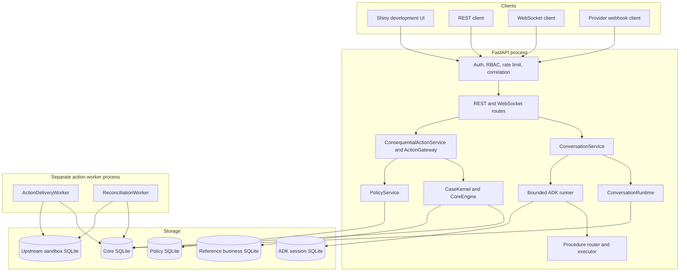
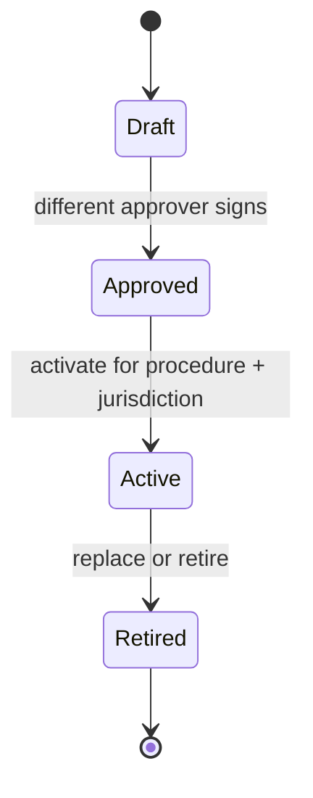
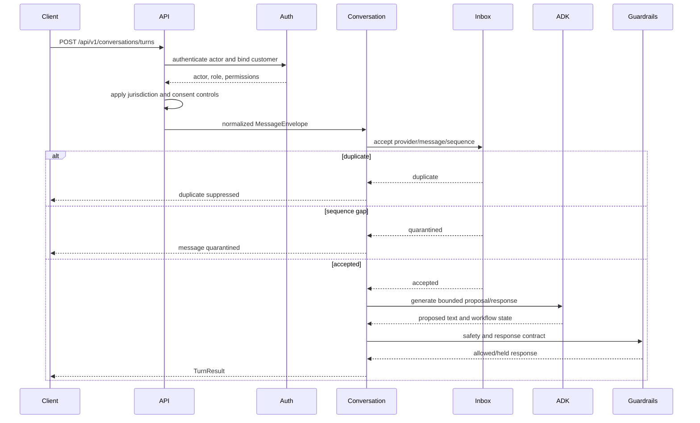
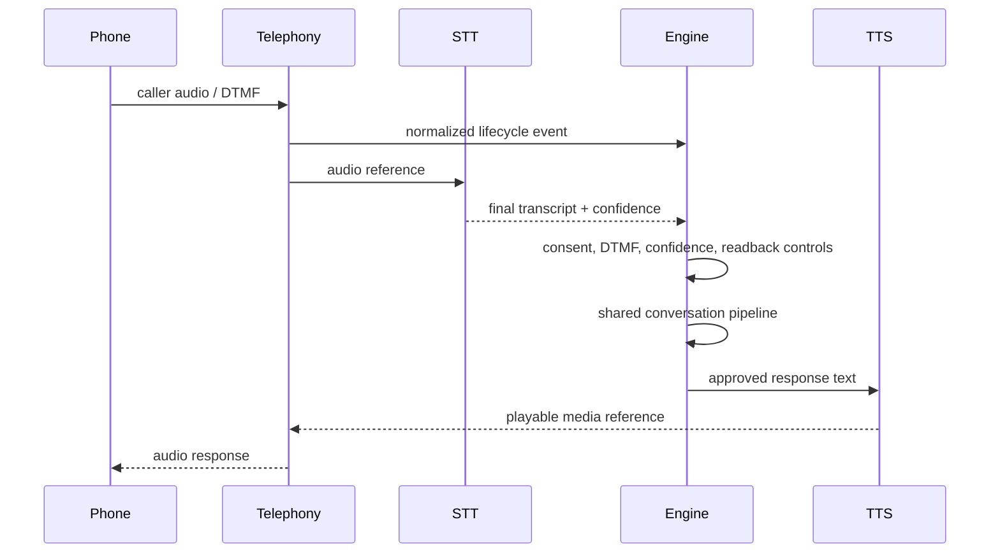
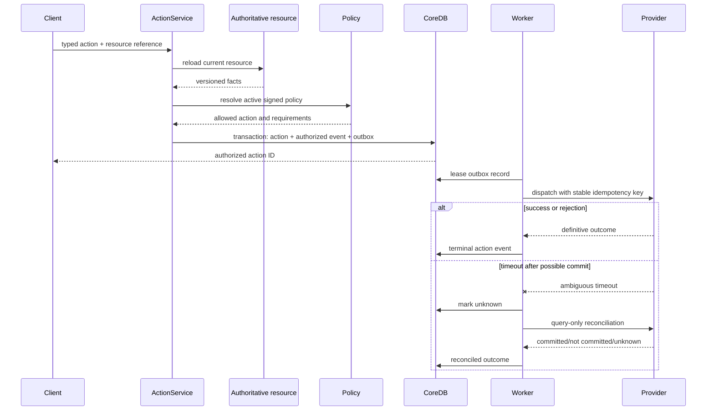
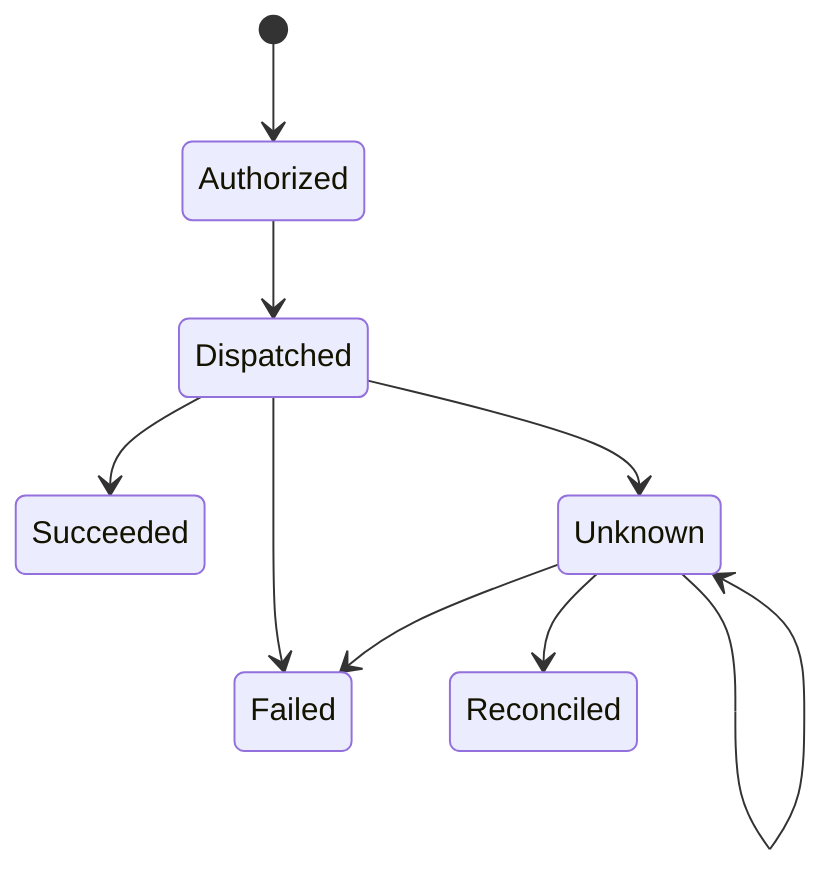
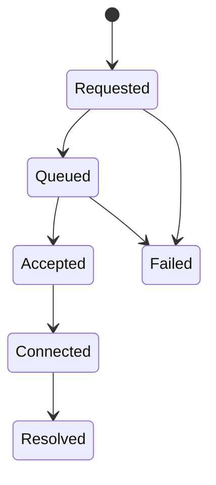

# Application Architecture

This document explains what the application is, how a request moves through it,
which components are authoritative, where data is stored, and where the current
implementation stops.

## 1. What the application is

The LLM-Powered Workflow Engine is a modular Python application for guided customer
service and operations workflows. It combines:

- a conversational layer powered by Google ADK and Gemini;
- deterministic YAML procedures and domain rules;
- a durable case, fact, policy, action, and delivery control plane;
- REST, WebSocket, chat, and IVR-facing contracts;
- development emulators for systems that would normally live outside the
  application.

The central design rule is:

> The model may propose intent, facts, and response wording. It may not authorize
> or directly execute a consequential business action.

Consequential actions include refunds, provisional credits, account restrictions,
SAR submission, dispute filing, case changes, and human escalation. These actions
must pass deterministic validation, authorization, active policy, evidence,
idempotency, and durable delivery controls.

## 2. System context

The checked-in repository fully implements the engine boundary, SQLite-backed
reference stores, a provider-bundle loader, and local emulators. It does **not**
ship vendor-specific telephony, speech, contact-center, or business-system
integrations; deployments supply those adapters through `PROVIDER_BUNDLE_FACTORY`.

## 3. Runtime containers and processes

The line from `ConversationService` to the core database represents only durable
inbox/deduplication/order state. It does **not** mean a chat turn automatically
executes an action. Typed actions enter through separate action endpoints and then
flow through `ConsequentialActionService` and `ActionGateway`.

The Docker configuration starts the API, Shiny UI, and a separate worker service.
The worker continuously runs action delivery and reconciliation and handles
SIGINT/SIGTERM. Administrative run-once endpoints remain available for controlled
development and operations.

## 4. Major components

### FastAPI application

`main.py` is the composition root. It:

1. loads and validates settings;
2. creates database, policy, conversation, action, and provider components;
3. initializes stores during application lifespan;
4. registers REST and WebSocket routes;
5. applies authentication, authorization, CORS, correlation, rate limiting, and
   error handling.

This file currently contains both dependency wiring and HTTP handlers. It is the
best place to see the complete deployed component graph, but business rules should
remain in `workflow_engine/` modules.

### Conversation service

`workflow_engine/conversation/service.py` is the common chat/IVR application
service. It:

- accepts a normalized `MessageEnvelope`;
- asks `ConversationRuntime` to deduplicate and order the message;
- invokes the bounded turn processor only for accepted messages;
- applies the response contract;
- returns one `TurnResult` shape for chat and IVR.

`ConversationRuntime` persists provider-scoped message IDs and sequence state. A
duplicate is suppressed. A sequence gap is quarantined until the provider resends
the missing message.

The service does not create cases, verify business facts, authorize actions, or
dispatch providers. Its output is a guarded conversational response plus response
metadata.

### ADK and agent layer

The router agent selects customer-service, fraud-operations, or general handling.
Specialist agents use procedure instructions and read/proposal tools. In production,
the tool catalog removes consequential model tools from the executable tool set.

In development, the catalog currently exposes legacy local write tools so the old
demonstration scenarios can mutate the reference SQLite database. Those calls do
not use the v3 typed action gateway and must not be interpreted as the production
architecture. Production removes them and instructs the model not to claim that a
frozen action executed.

The ADK session database is deliberately separate from the core database. Model
state, prompts, and session history are not trusted evidence for authorization.

### Procedure layer

YAML files under `procedures/` describe step-oriented workflows. The procedure
registry maps intents to procedures. `ProcedureExecutor` tracks step progress,
branching, completion, and escalation for conversational guidance.

Procedures are not policy packages. A procedure tells the conversation what to
collect and explain. A signed policy package controls whether a consequential
action is permitted.

### Core kernel

`workflow_engine/core/kernel.py` owns durable control-plane records:

- workflow cases;
- asserted and verified facts;
- action attempts and lifecycle events;
- transactional outbox entries;
- provider message inbox and ordering state;
- human-handoff state.

The kernel uses optimistic compare-and-swap updates so concurrent requests cannot
silently overwrite one another. SQLite is the built-in implementation. Protocols
allow other databases, but no non-SQLite implementation ships with the repository.

### Policy service

Policy packages follow:

The author and approver must differ. Approved, active, and retired packages carry
HMAC signatures and a signing-key ID. Authorized actions retain the policy
activation signature so already-authorized work remains verifiable after policy
rotation or retirement.

### Consequential action service and gateway

The action service accepts a closed, typed command. It reloads an authoritative
resource, compares caller parameters with that resource, verifies permission,
policy, evidence, consent, and approval requirements, then creates an action.

The gateway controls dispatch. Action authorization and outbox insertion occur in
one transaction. The model never calls a provider directly.

### Provider adapters

Provider protocols exist for:

- speech to text;
- text to speech;
- telephony events;
- outbound chat and receipts;
- human-agent handoff;
- consequential action dispatch and reconciliation.

The repository ships only development implementations in
`workflow_engine/integrations/sandbox.py`. They are intentionally simulated:

- STT uses a supplied transcript hint;
- TTS returns a `sandbox://` media reference;
- telephony returns an acknowledgment receipt;
- chat records a local simulated delivery receipt;
- handoff creates a SQLite ticket;
- actions create SQLite effects with configurable timeout/rejection behavior.

`UPSTREAM_MODE=provider` loads a trusted callable from
`PROVIDER_BUNDLE_FACTORY`. The callable receives validated settings and returns a
`ProviderBundle` containing STT, TTS, telephony, chat, handoff, action, and
authoritative-resource adapters. The repository provides the loader and contract,
but no vendor bundle or credentials.

## 5. End-to-end chat request

This sequence ends with a conversational response. It does not enter the action
gateway. If the conversation determines that a consequential action is appropriate,
a trusted client/application integration must make a separate typed action request.
That integration bridge is not automated by `ConversationService` in v3.1.0.

### Why conversation and action are separate

The separation prevents a model utterance such as “I will refund that now” from
becoming a financial effect. Conversation is allowed to be probabilistic; action
authorization must be deterministic and evidence-backed.

There are therefore two application entry paths:

1. **Conversation path** — `/chat`, `/conversations/turns`, or WebSocket → inbox
   acceptance → ADK/procedure → guardrails/reasoning → response.
2. **Action path** — `/core/actions` or `/core/refunds` → authoritative resource
   reload → case/facts → RBAC/policy/evidence → action/outbox → worker/provider.

The intended product integration may use the result of a conversation to populate
an action form or command, but it must not trust model-generated parameters. It must
submit typed identifiers, consent/approval evidence, and an idempotency key; the
action service reloads authoritative values before authorization.

The compatibility `/api/v1/chat` endpoint delegates to the same processing path.
The WebSocket endpoint uses the same conversation service but returns WebSocket
frames rather than HTTP responses.

## 6. End-to-end IVR request

There are two IVR-facing layers:

1. Provider adapter endpoints normalize STT, TTS, and telephony events.
2. The canonical conversation endpoint processes the final transcript through the
   same service used by chat.

In the checked-in sandbox no audio is processed. The STT request must contain a
transcript hint, and TTS returns a fake media reference.

## 7. Consequential action lifecycle

The system never blindly redispatches an ambiguous action. Stable idempotency keys
and query-only reconciliation protect against duplicate provider effects.

### Action states

Only `succeeded` and a successful `reconciled` outcome support a customer-visible
claim that the action completed.

## 8. Human handoff lifecycle

Queue acknowledgment is not the same as connection to a human. Compare-and-swap
transitions prevent two agents from accepting the same handoff concurrently.

The current provider is a SQLite queue emulator. It does not connect to a contact
center or route work to a real person.

## 9. Data ownership and trust

| Data | Owner | Trusted for authorization? |
|---|---|---|
| ADK session and model messages | ADK session store | No |
| User statements and transcripts | Conversation inbox | Asserted only |
| Provider/resource snapshots | Authoritative resource adapter | Yes, after validation |
| Cases and verified facts | Core store | Yes |
| Signed policy packages | Policy repository | Yes, after signature/lifecycle checks |
| Action and outbox records | Core store | Yes |
| Provider outcomes | Provider adapter plus reconciliation | Yes when definitive |
| Sandbox effects | Local development emulator | Development evidence only |

## 10. Storage topology

The default development configuration uses several SQLite concerns:

- `workflow.db`: reference business data, local audit, core store, and policy store
  by default;
- `adk_sessions_v2.db`: ADK sessions and events;
- `upstream_sandbox.db`: simulated provider resources, effects, receipts, and
  handoffs.

These may share a host but have different trust and retention rules. ADK state must
not be used to authorize actions.

Non-SQLite core and policy stores can be supplied through trusted factory settings.
The repository does not include a PostgreSQL adapter and must not be described as
shipping PostgreSQL support.

## 11. Authentication and actor/customer identity

Authentication uses HMAC-signed JWTs when enabled. The authenticated actor and the
customer being served are separate identities. RBAC controls read, action,
integration, callback, escalation, policy, and administrative permissions.

Development defaults to authentication disabled. Production validation requires
authentication, a non-default JWT secret, a non-default policy signing key,
non-wildcard CORS, and sandbox mode disabled.

The Shiny UI reads `BACKEND_URL`, can attach a deployment-supplied
`BACKEND_AUTH_TOKEN`, and uses canonical v3 APIs. It remains a development/operator
console rather than an identity-aware customer portal; a static token is not an
appropriate production login design.

## 12. Deployment modes

| Mode | Intended use | Upstream behavior |
|---|---|---|
| `dev` + sandbox | Local development and deterministic tests | SQLite emulators enabled. |
| staging/production + disabled | Safe integration preparation | Consequential/provider endpoints fail closed. |
| provider | Deployment integration mode | Loads a trusted, complete `ProviderBundle`; vendor code and credentials are deployment-supplied. |

The production Compose file is a reference boundary, not a complete production
platform. It includes one API process and one worker process for the supported
single-host SQLite fallback, but real provider adapters, secret-manager wiring,
external TLS/ingress, monitoring, backups, and approved storage remain deployment
responsibilities.

## 13. Failure handling

- Duplicate inbound message: suppress it using provider ID plus message ID.
- Sequence gap: quarantine the message and wait for ordered resend.
- Invalid/expired policy: reject authorization.
- Resource mismatch: reject caller-supplied action parameters.
- Provider unavailable before commit: retry according to outbox policy.
- Provider timeout after possible commit: mark unknown and reconcile without
  redispatch.
- Worker crash after leasing: lease expiry makes work recoverable.
- Audit-chain mismatch: report failure through the operations endpoint; external
  incident response remains a deployment responsibility.

## 14. What is deliberately out of scope today

- real STT, TTS, telephony, chat, contact-center, and business-system providers;
- a customer-grade production web portal;
- packaged PostgreSQL or another distributed database adapter;
- a full policy-authoring product;
- legal approval of NAM or Regulation E behavior;
- managed secrets, TLS ingress, SIEM export, and enterprise identity federation;
- vendor-specific provider bundles and credentials;
- Prometheus and OpenTelemetry implementation.

See [Current Implementation Status](current-state.md) for the precise capability
matrix and remaining work.
