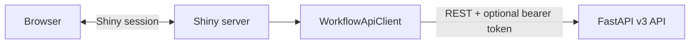

# Shiny Development and Operator Console

## Purpose

The Shiny application is a development/operator console for exercising the engine.
It is not a production customer portal and does not replace a contact-center agent
desktop.

## Architecture

`app_ui.py` owns presentation and reactive state. All HTTP access goes through
`workflow_engine.ui.WorkflowApiClient`, which:

- reads `BACKEND_URL` or defaults to `http://localhost:8000`;
- reads optional `BACKEND_AUTH_TOKEN`;
- attaches a bearer header when configured;
- uses canonical `/api/v1` routes;
- centralizes HTTP timeout and error behavior.



## Run locally

Start the backend:

```bash
uvicorn main:app --port 8000
```

Start the console:

```bash
BACKEND_URL=http://localhost:8000 shiny run app_ui.py --port 8001
```

If backend authentication is enabled:

```bash
BACKEND_URL=http://localhost:8000 \
BACKEND_AUTH_TOKEN=replace-with-short-lived-token \
shiny run app_ui.py --port 8001
```

Do not bake the token into an image or commit it.

## Screens

### Chat

Sends a message to `/api/v1/chat`, tracks the returned session ID, refreshes
workflow state, and displays the guarded model response.

### Test Scenarios

Provides seeded prompts for refund, complaint, fraud, and Regulation E flows. A
scenario selects a customer and sends a prompt through the same chat API.

Scenario labels describe expected behavior, but model wording is observational.
Deterministic correctness belongs to the core/API test suite.

### Data Browser

Reads only backend-allow-listed reference tables through `/api/v1/tables/{name}`.
It is for local inspection, not arbitrary SQL access.

### System Status

Displays:

- `/health` process/version/mode information;
- `/api/v1/metrics` core operational counts;
- `/api/v1/operations/audit-integrity` hash-chain verification.

The token must have the required administrative read permission for protected
status endpoints.

### Sidebar

Shows customer selection, prior sessions, workflow state, loaded procedures, and
the configured backend address.

## Docker

`docker-compose.yml` sets `BACKEND_URL=http://backend:8000`, starts the API, waits
for `/ready`, and starts the UI and worker services. The earlier hardcoded-localhost
defect is fixed in v3.1.0.

The production overlay enables backend auth but does not create an identity-aware UI
login flow. A deployment that retains this console must inject a suitable token or
place it behind a trusted operator access layer.

## What the UI does not provide

- audio capture, call control, or IVR media playback;
- real provider delivery or contact-center staffing;
- policy authoring and approval workflows;
- full action/outbox/reconciliation/handoff administration;
- customer-grade authentication, accessibility certification, localization, or
  product analytics;
- a complete browser automation suite.

Swagger remains the complete development interface for action, provider, handoff,
policy, and worker APIs.

## Test evidence

`tests/test_ui_client.py` verifies:

- environment-based backend URL;
- optional bearer header;
- canonical v3 paths;
- API client behavior;
- app import and ASGI HTML rendering.

This proves the server/client contract, not every browser interaction. A
customer-facing frontend would require Playwright-level interaction, accessibility,
responsive-layout, session, and identity tests.

## Troubleshooting

| Symptom | Likely cause | Check |
|---|---|---|
| “Could not load customers” | Backend unreachable or unauthorized | `BACKEND_URL`, `/ready`, token. |
| Chat returns 401/403 | Missing/underprivileged token | `BACKEND_AUTH_TOKEN` role and customer binding. |
| Status panel fails | Token lacks admin read | RBAC permissions. |
| No model response | Missing Gemini credential or provider error | API logs and `GOOGLE_API_KEY`/Vertex config. |
| Scenario result differs | Model variation or changed seed data | Core tests, workflow state, and scenario assumptions. |
